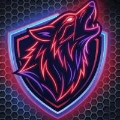

# ATYLA Collective

### Independent security research and CTF team

  

  

  
  

<i>Applied vulnerability research, low-level exploitation and CTF competition.</i>

---

### Members

| Member | Focus |
|---|---|
| [Pablo Alonso Carrillo](https://github.com/pablo-alonso-c) | Offensive security, cryptography, OSINT |
| [Alejandro Herreros Rueda](https://github.com/aherreros-dev) | Reverse engineering, forensics, malware analysis |

---

### What we work on

- **Cryptography** — attacks on implementations rather than primitives:
  biased nonces, lattice reduction.
- **Network protocols** — packet analysis and traffic manipulation.
- **OSINT** — reconnaissance and attack surface mapping.
- **Binary exploitation** — memory corruption and modern mitigations (ASLR, DEP).
- **Reverse engineering** — binary analysis and firmware extraction.
- **Active Directory** — privilege escalation and lateral movement.

---

### CTFs

**47CON CTF (2026)** — all challenges solved, 7600 points. Technical recognition
from Asociación SUGUS. Categories: Web, Crypto, Pwn, OSINT...
→ [Writeups](https://github.com/ATYLA-Collective/CTF-writeups/tree/main/47CON_2026)

**RootedCON Yarix CTF (2026)** — Active Directory, web security, and data
poisoning against a machine learning model.

---

### Tools

  
  
  
  

---

<i>Security through rigorous and applied verification.</i>

